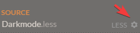
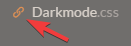

## Filetype
The final stylesheet [Darkmode.css](./../Darkmode.css) is generated with use of the Less CSS preprocessor.  
Taken from http://lesscss.org/ :

>Less (which stands for Leaner Style Sheets) is a backwards-compatible language extension for CSS. Because Less looks just like CSS, learning it is a breeze. Less only makes a few convenient additions to the CSS language, which is one of the reasons it can be learned so quickly.

For more information about less, head over to http://lesscss.org/

## Filetree
[Darkmode.css](Darkmode.css) is the output of the Less preprocessor. Any changes made here will be overwritten later again when the result is compiled, so direct changes made to this file are futile.  
[Darkmode.less](Darkmode.less) is the main file where everything starts, all other `.less` files are imports to `Darkmode.less`. The main file should contain all used main colors in a variable so they can be easily changed if necessary. If you add to any of the less files please add a comment describing what your css applies to.  
[Mixins.less](Mixins.less) and [Standard wikia mixins.less](Standard%20wikia%20mixins.less) contain a bunch of usefull  mixins to make cross browse support or styling similar elements easier.

## Getting started
There are multiple methodes you can use to compile less files into css files, I will list two here:
### Using Node.js
If you don't have Node already installed, download it from here https://nodejs.org/en/download/  
Now you have two options:
* Always use the command line to compile 
  * Use `npm install -g less` to install the compiler. You only have to do this once.
  * Then in the root directory of the repository use `lessc ./.less/Darkmode.less Darkmode.css` to turn the .less files into the final .css file
* Use Gulp to automate compilation on save
  * Install the `gulp` command with `npm install -g gulp-cli`
  * Install all dependencies in the root of the repository with `npm install`
  * You only have to do the above two lines once. [More info about installing gulp](https://github.com/gulpjs/gulp/blob/v3.9.1/docs/getting-started.md)
  * Now typing `gulp` in the console. Now everytime you save any of the .less files Darkmode.css will automaticly update and changes will be visible in the browser. You only have to run this command once until you terminate it with `ctrl + c`

### Using Crunch
If you don't like using the terminal there is another option for you.  
* Download [Crunch 2](https://getcrunch.co/) and install it.
* Open the program and add the folder of the repository
* Navigate to `Darkmode.less` and double click it
* Click on the big orange button  
   
* click on the cog next to Source and disable `Sourcemap`  
   
* Now doubleclick on all the files listed under `LESS`
* If `Darkmode.css` appears in the wrong place (inside the `.less` folder instead of outside), then click on chain to the left of `Darkmode.css` and navigate to the correct place  
   

Now you are all set to go. If you want to compile your less files intoan output simply press save or click on the  button. You can also use another program such as visual studio code, atom, sublime or notepad++ to edit the .less files, Crunch will watch for filechages and automaticly compile when you save if Crunch is open in the background. To see the effect of your changes you can use stylus(recommended) or stylish to inject the css into the browser.
