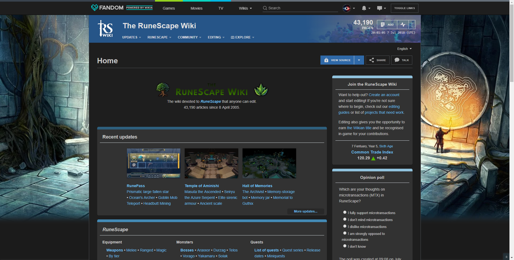

## RS-wiki-DarkMode
This is a dark theme for the [Runescape wiki](http://runescape.wikia.com/wiki/RuneScape_Wiki).

## Preview

More images: https://imgur.com/a/Ka7sp

## Installing
### Installing as userstyle:
#### Step 1: StyleManager
* Stylus - get the addon for [Firefox](https://addons.mozilla.org/en-US/firefox/addon/styl-us/), [Chrome](https://chrome.google.com/webstore/detail/stylus/clngdbkpkpeebahjckkjfobafhncgmne) and [Opera](https://addons.opera.com/en-gb/extensions/details/stylus/).
#### Step 2: UserStyle
* Install from [Github](https://raw.githubusercontent.com/CephHunter/RS-wiki-DarkMode/master/Darkmode.user.css).
* Install from [Usercss.org](https://openusercss.org/theme/5b416bc66368470b00f15797).
### Installing as a userscript
#### Step 1: ScriptManager
*  [Greasemonkey](https://addons.mozilla.org/firefox/addon/greasemonkey/)
*  [Tampermonkey](https://chrome.google.com/webstore/detail/tampermonkey/dhdgffkkebhmkfjojejmpbldmpobfkfo)
*  [Tampermonkey](https://chrome.google.com/webstore/detail/tampermonkey/dhdgffkkebhmkfjojejmpbldmpobfkfo)
*  [Tampermonkey](https://chrome.google.com/webstore/detail/tampermonkey/dhdgffkkebhmkfjojejmpbldmpobfkfo)
*  [Tampermonkey](https://chrome.google.com/webstore/detail/tampermonkey/dhdgffkkebhmkfjojejmpbldmpobfkfo)
#### Step 2: UserScript
* [install](https://raw.githubusercontent.com/CephHunter/RS-wiki-DarkMode/master/Darkmode.user.js) from *Github.com*
* [install](https://userstyles.org/styles/userjs/150266/runescape-wiki-darkmode.user.js) from *userstyles.org*

### Installing with a wikia account
* Advantages: You don't need to install any extensions.
* Disadvantages: You need to manually update, and the only way to easily disable the style is by loggin out.
#### Step 1: Wikia account
You can create an account under the "My account" dropdown at the top of any page on the [Runescape wiki](http://runescape.wikia.com/wiki/RuneScape_Wiki). When your account is created make sure you are logged in.
#### Step 2: Installing the style
* Go to https://runescape.wikia.com/wiki/Special:MyPage/common.css
* Click on create page
* Add `@import "https://cdn.rawgit.com/CephHunter/RS-wiki-DarkMode/b0499bf/Darkmode.min.css";` to the top of the page and save.
* If you want to update to the latest version replace `b0499bf` with the latest commit hash found [here](https://github.com/CephHunter/RS-wiki-DarkMode/commits/master/Darkmode.min.css).

### Updating
If a recent change by Wikia broke the style, chances are that I already fixed it. Make sure to reinstall from [Usercss.org](https://openusercss.org/theme/5b416bc66368470b00f15797) or [GitHub](https://raw.githubusercontent.com/CephHunter/RS-wiki-DarkMode/master/Darkmode.user.css) before opening an issue. 

## Contributing/reporting issues
Help is always appreciated, the Runescape wiki site is huge and always changing and I may not always notice when stuff gets broken. So if you find any problems you can always [open an issue on github](https://github.com/CephHunter/RS-wiki-DarkMode/issues) or leave a message on [this Runescape wiki talkpage](http://runescape.wikia.com/wiki/User_talk:CephHunter/Dark_mode_issues) or message me on Discord `@ceph hunter#6854`, I frequently hang out in the [Runscape wiki Discord](http://runescape.wikia.com/wiki/RuneScape:Off-site/Discord).

If you would like to contribute to the stylesheet head over to [.less#readme](.less#readme) for more information.
